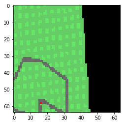
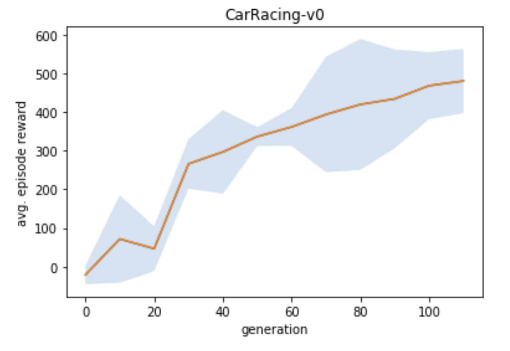

# World Models
This repo reproduces the [original implementation](https://github.com/hardmaru/WorldModelsExperiments) of [World Models](https://arxiv.org/abs/1803.10122). This implementation uses TensorFlow 2.2.

## What We Have Done
#### Task One


#### Task Two

We manage to set up the project and go through the pipeline of Car-racing learning process. 

- [extract.py](./WorldModels/extract.py) 
Utilize 4 workers to generate 160 scenes(.npz), altogether 640 scenes(.npz) in which contains at most 1000 frames at least 100 frames and save in the [record folder](./WorldModels/results/WorldModels/CarRacing-v0/record)

- [vae_train.py](./WorldModels/vae_train.py)
load and unpack all the .npz file from the [record folder](./WorldModels/results/WorldModels/CarRacing-v0/record), feed in args(batch_size=100, learning_rate=0.0001, kl_tolerance=0.5, epoch_num=10) in vae architecture, the training tensorflow summary is [here](./WorldModels/results/WorldModels/CarRacing-v0/tf_vae/tensorboard), the saved_model is [here](./WorldModels/results/WorldModels/CarRacing-v0/tf_vae/saved_model.pb)

- [series.py](./WorldModels/series.py)
take care of encode and decode batch data, series data is [here](./WorldModels/results/WorldModels/CarRacing-v0/series/series.npz)

- [rnn_train.py](./WorldModels/rnn_train.py)
use series data to perform RNN, feed in args(steps=4000, max_seq_len=1000, rnn_size=256, learning_rate=0.001, decay_rate=1.0, temperature=1.0), training tensorflow summary is [here](./WorldModels/results/WorldModels/CarRacing-v0/tf_rnn/tensorboard), the saved model is [here](./WorldModels/results/WorldModels/CarRacing-v0/tf_rnn/saved_model.pb)

- [train.py](./WorldModels/train.py)
make real CarRacing environment and start training with 4 workers. Save all the evaluations and results [here](./WorldModels/results/WorldModels/CarRacing-v0/log)

logs can be found [here](./runlog.txt)


#### Task Three (GAN-VAE)
[gan.py](./WorldModels/gan.py) or [vae-gan.ipynb](./WorldModels/vae-gan.ipynb) 
We look into GAN method and implement it in our case so that it could use data generated in the [record folder](./WorldModels/results/WorldModels/CarRacing-v0/record) with args(batch_size=32, Depth=32, Latent_depth=512, K_size=10, learning_rate=0.0001, normal_coefficient=0.1, kl_coefficient=0.01). The Discriminator, Encoder, and Generator weights can be find in the [saved-models folder](./WorldModels/saved-models), training logs can be found [here](./WorldModels/logs/sep_D32L512)

## Docker
The easiest way to handle dependencies is with [Nvidia-Docker](https://github.com/NVIDIA/nvidia-docker). Follow the instructions below to generate and attach to the container.
```
docker image build -t wm:1.0 -f docker/Dockerfile.wm .
docker container run -p 8888:8888 --gpus '"device=0"' --detach -it --name wm wm:1.0
docker attach wm
```

## Visualizations
To visualize the environment from the agents perspective or generate synthetic observations use the [visualizations jupyter notebook](WorldModels/visualizations.ipynb). It can be launched from your container with the following:
```
xvfb-run -s "-screen 0 1400x900x24" jupyter notebook --port=8888 --ip=0.0.0.0 --allow-root
```

Real Frame Sample             |  Reconstructed Real Frame  |  Imagined Frame
:-------------------------:|:-------------------------:|:-------------------------:|
|  | 

Ground Truth (CarRacing)             |  Reconstructed
:-------------------------:|:-------------------------:
 | 


## Reproducing Results From Scratch
These instructions assume a machine with a 64 core cpu and a gpu. If running in the cloud it will likely financially make more sense to run the extraction and controller processes on a cpu machine and the VAE, preprocessing, and RNN tasks on a GPU machine.

### DoomTakeCover-v0
**CAUTION** The doom environment leaves some processes hanging around. In addition to running the doom experiments, the script kills processes including 'vizdoom' in the name (be careful with this if you are not running in a container).
To reproduce results for DoomTakeCover-v0 run the following bash script.
```
bash launch_scripts/wm_doom.bash
```

### CarRacing-v0
To reproduce results for CarRacing-v0 run the following bash script
```
bash launch_scripts/carracing.bash
```

## Disclaimer
I have not run this for long enough(~45 days wall clock time) to verify that we produce the same results on CarRacing-v0 as the original implementation.

Average return curves comparing the original implementation and ours. The shaded area represents a standard deviation above and below the mean. 



For simplicity, the Doom experiment implementation is slightly different than the original
* We do not use weighted cross entropy loss for done predictions 
* We train the RNN with sequences that always begin at the start of an episode (as opposed to random subsequences)
* We sample whether the agent dies (as opposed to a deterministic cut-off)

|  |\tau | Returns Dream Environment  &nbsp;&nbsp;&nbsp;&nbsp;&nbsp;&nbsp;| Returns Actual Environment  &nbsp;&nbsp;&nbsp;&nbsp;&nbsp;&nbsp;
|------|------|------|------|
|   D. Ha Original  | 1.0 | 1145 +/- 690 | 868 +/- 511 |
|   Eager  |  1.0 | 1465 +/- 633 | 849 +/- 499 |
